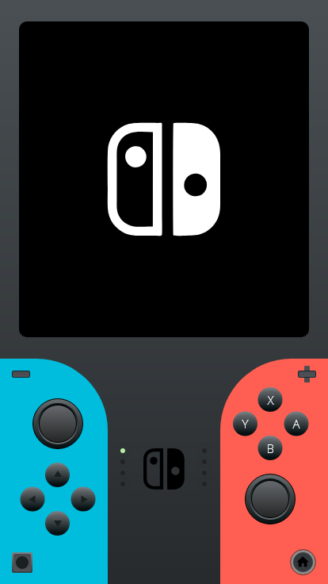

# Nintendo Switch Challenge

Challenge proposed by Flutterando community.
Figma layout and initial challenge made by Maxweel Freitas.
https://github.com/MaxweelFreitas/NintendoSwt

## Mockup Link
https://www.figma.com/file/EVeqd5Nlgr3MNE2JyespMj/NintendoSwt-Flutterando?node-id=0%3A1

## Mockup Objetive Screenshot

## Actual State of Challenge
Made in March 07th, 2021 
Total amount of time: 3h

